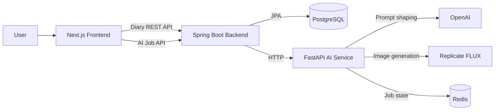

# Sketch My Day

Sketch My Day is a full-stack illustrated diary application. A user signs in with Google, writes a dated diary entry with a mood and todo reflections, asks AI to generate an illustration, and looks back through saved entries on a diary board.

## System Overview

The repository is split into three services:

```text
frontend/      Next.js UI and Supabase authentication
backend/       Spring Boot REST API, diary persistence, and AI service proxy
ai-service/    FastAPI image generation job service
```



### Main Flows

1. **Diary save and read**
   - The frontend gets the signed-in Supabase user ID.
   - It calls the Spring Boot diary API.
   - Spring Boot reads or saves diary data in PostgreSQL through Spring Data JPA.

2. **AI illustration generation**
   - The frontend asks Spring Boot to create an image generation job.
   - Spring Boot forwards the request to the FastAPI AI service.
   - FastAPI creates a job, stores its status in Redis, uses OpenAI to turn diary content into illustration prompts, and uses Replicate to generate the image.
   - The frontend polls Spring Boot for the job status and displays the returned illustration URL when the job is complete.

## Tech Stack

| Area | Stack |
| --- | --- |
| Frontend | Next.js 16, React 19, TypeScript, Tailwind CSS, Supabase Auth |
| Backend | Java 21, Spring Boot, Spring Web MVC, Spring Data JPA, PostgreSQL, WebClient |
| AI Service | Python, FastAPI, OpenAI API, Replicate, Redis |
| Packaging | Dockerfiles for frontend, backend, and AI service |

## Repository Guide

```text
sketch-my-day/
├── frontend/
│   ├── app/                 Next.js App Router pages
│   ├── components/diary/    Diary editor, board, calendar, and shared diary types
│   ├── lib/                 Supabase client and utility helpers
│   └── public/              Mood images and static assets
├── backend/
│   └── src/main/
│       ├── java/.../diary/  Diary controller, service, repository, entity, and DTOs
│       ├── java/.../ai/     AI proxy controller, service, and API DTOs
│       ├── java/.../config/ CORS and AI WebClient configuration
│       └── resources/       Spring application configuration
└── ai-service/
    ├── app/                 FastAPI routes, generation logic, and Pydantic schemas
    ├── scripts/             AI smoke test script
    └── docker-compose.yml   AI service plus Redis for local container runs
```

## Frontend

The frontend is a Next.js App Router application. It owns the browser experience, Supabase OAuth session handling, and calls to the Spring Boot API.

### Key Files

| File | Responsibility |
| --- | --- |
| `frontend/app/page.tsx` | Home page, Google login/logout, and entry point into today's diary |
| `frontend/app/auth/callback/page.tsx` | Exchanges the Supabase OAuth callback code for a session |
| `frontend/app/diary/[date]/page.tsx` | Loads one dated diary and decides whether the editor is in create or edit mode |
| `frontend/components/diary/DiaryEditor.tsx` | Main writing UI, save request, todo/reflection state, mood state, and AI job polling |
| `frontend/app/diary-board/page.tsx` | Loads diary summaries for the signed-in user |
| `frontend/components/diary/HangingNotes.tsx` | Shows the latest diary previews as notes |
| `frontend/components/diary/DiaryCalender.tsx` | Shows diary entries in a monthly calendar |
| `frontend/components/diary/diaryTypes.ts` | Shared mood and diary summary types |
| `frontend/lib/supabaseClient.ts` | Browser Supabase client setup |

### Frontend Routes

| Route | Purpose |
| --- | --- |
| `/` | Home and authentication entry |
| `/auth/callback` | Supabase OAuth callback |
| `/diary` | Redirects to today's dated diary route |
| `/diary/:date` | Diary create/edit screen for a date |
| `/diary-board` | Diary summary board and calendar |

## Backend

The backend is the application API layer. It keeps diary persistence in Spring Boot and hides the FastAPI AI service behind Spring endpoints used by the frontend.

### Key Files

| File | Responsibility |
| --- | --- |
| `backend/src/main/java/sketch_my_day/demo/SketchMyDayApplication.java` | Spring Boot application entry point |
| `backend/src/main/java/sketch_my_day/demo/HealthController.java` | `GET /health` health check |
| `backend/src/main/java/sketch_my_day/demo/diary/DiaryController.java` | Diary HTTP endpoints |
| `backend/src/main/java/sketch_my_day/demo/diary/DiaryService.java` | Diary query, save-or-update logic, and entity-to-DTO mapping |
| `backend/src/main/java/sketch_my_day/demo/diary/DiaryRepository.java` | JPA repository queries by user and diary date |
| `backend/src/main/java/sketch_my_day/demo/diary/Diary.java` | JPA entity mapped to the `diaries` table |
| `backend/src/main/java/sketch_my_day/demo/diary/dto/` | Diary request and response DTOs |
| `backend/src/main/java/sketch_my_day/demo/ai/AiImageController.java` | Spring endpoints for AI image jobs |
| `backend/src/main/java/sketch_my_day/demo/ai/AiImageService.java` | Calls FastAPI with `WebClient` |
| `backend/src/main/java/sketch_my_day/demo/config/AiServiceConfig.java` | Validates AI base URL and creates the AI `WebClient` bean |
| `backend/src/main/java/sketch_my_day/demo/config/CorsConfig.java` | Allows configured frontend origins to call `/api/**` |
| `backend/src/main/resources/application.yml` | Port, database, CORS, AI service, and OpsLens settings |

### Backend APIs

| Method | Endpoint | Purpose |
| --- | --- | --- |
| `GET` | `/health` | Check backend availability |
| `GET` | `/api/diaries?userId=...` | Return diary summaries for a user |
| `GET` | `/api/diaries/{date}?userId=...` | Return one diary for a user and date |
| `POST` | `/api/diaries` | Create or update a diary for a user and date |
| `POST` | `/api/ai/generate-image` | Create an AI image generation job |
| `GET` | `/api/ai/generate-image/{jobId}` | Read AI image job status |

The diary package follows a standard Spring flow:

```text
Controller -> Service -> Repository -> PostgreSQL
```

`DiaryService.saveDiary()` implements the main write logic: it looks up a diary by `userId` and `entryDate`, updates it if it already exists, or creates a new `Diary` entity before saving it.

## AI Service

The AI service is a FastAPI application built around background image generation jobs. It is called by Spring Boot, not directly by the frontend.

### Key Files

| File | Responsibility |
| --- | --- |
| `ai-service/app/main.py` | FastAPI routes, Redis job storage, OpenAI prompt generation, and Replicate image generation |
| `ai-service/app/schemas.py` | Pydantic request and response schemas |
| `ai-service/requirements.txt` | Python dependencies |
| `ai-service/docker-compose.yml` | Local AI service and Redis container setup |
| `ai-service/scripts/smoke-test-generate-image.sh` | Smoke test for the generation endpoint |

### AI Endpoints

| Method | Endpoint | Purpose |
| --- | --- | --- |
| `GET` | `/health` | Check AI service availability |
| `POST` | `/generate-image` | Create a background generation job |
| `GET` | `/generate-image/{job_id}` | Read job status and generated output |

The AI job lifecycle is:

```text
pending -> processing -> completed
                       -> failed
```

Completed jobs can return an illustration URL, summary, generated prompt, negative prompt, and error state.

## Configuration

### Frontend Environment

Create `frontend/.env` and provide:

```text
NEXT_PUBLIC_SUPABASE_URL=
NEXT_PUBLIC_SUPABASE_ANON_KEY=
NEXT_PUBLIC_API_BASE_URL=http://localhost:8080
```

For Google OAuth, configure Supabase to redirect local sign-ins to:

```text
http://localhost:3000/auth/callback
```

### Backend Environment

The Spring Boot backend reads:

```text
DB_URL=
DB_USER=
DB_PASSWORD=
CORS_ALLOWED_ORIGINS=http://localhost:3000
AI_SERVICE_BASE_URL=http://127.0.0.1:8000
```

Optional OpsLens settings are also defined in `application.yml`.

### AI Service Environment

The FastAPI service reads:

```text
OPENAI_API_KEY=
REPLICATE_API_TOKEN=
REDIS_URL=redis://localhost:6379/0
```

## Local Development

Start each service in its own terminal.

### Frontend

```bash
cd frontend
npm install
npm run dev
```

### Backend

```bash
cd backend
./gradlew bootRun
```

### AI Service

```bash
cd ai-service
python3 -m venv .venv
source .venv/bin/activate
pip install -r requirements.txt
uvicorn app.main:app --host 127.0.0.1 --port 8000 --reload
```

The AI service also needs Redis. For a container-based local run, `ai-service/docker-compose.yml` starts both the AI service and Redis.
