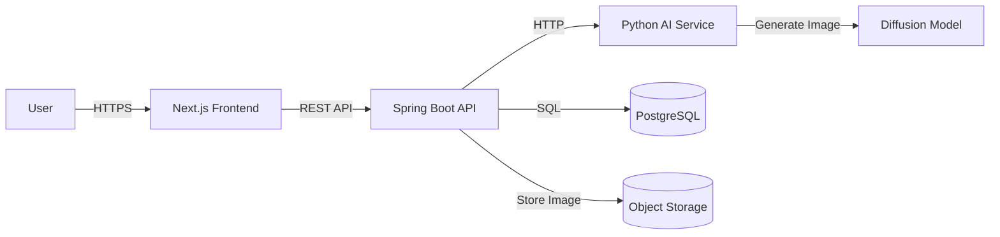
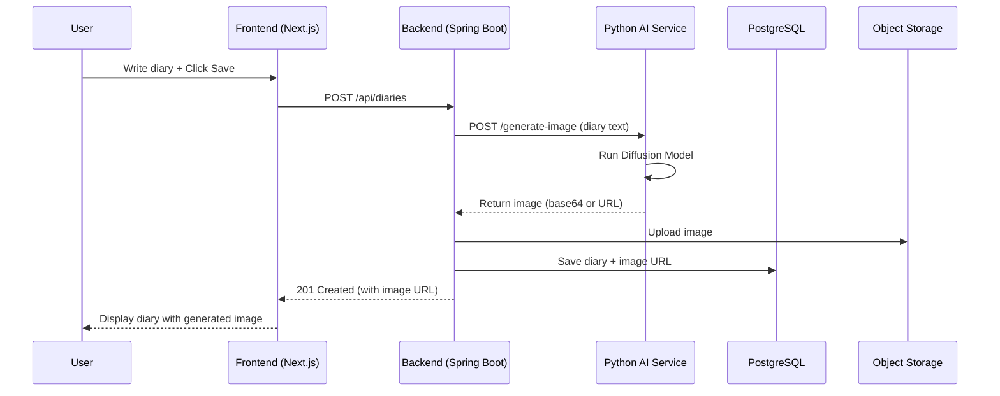

# Sketch My Day 

A full stack diary application. This project focuses on learning by building, starting with a clean frontend and gradually integrating a Spring Boot backend, CI pipeline, AI service, and cloud deployment.

---

## 🚀 Tech Stack

### Frontend
- Next.js 16
- React 19
- TypeScript
- Tailwind CSS
- Zustand (state management)
- Axios (API communication)
- Supabase Auth (Google OAuth)

### Backend (Planned)
- Java 21
- Spring Boot
- Spring Web
- Spring Data JPA
- PostgreSQL
- Spring Security + JWT (later)

### DevOps
- GitHub Actions (CI)
- Docker (planned)
- AWS (planned)
- Kubernetes (planned)

### AI Service
- Python
- FastAPI
- Diffusion Model (Stable Diffusion)
- PyTorch (planned)

---
## 🏗 Architecture (AI Integrated)

This flowchart illustrates the overall system architecture. It shows how the Next.js frontend communicates with the Spring Boot backend, and how the backend coordinates with the Python AI Service, the PostgreSQL database, and Object Storage.


This sequence diagram details the step-by-step process when a user creates a new diary entry. It highlights the sequence of API calls, the image generation process by the Diffusion Model, and how the final data is saved before returning a response to the user.


## Supabase OAuth Setup (Frontend)

1. Prepare env file
```bash
cd frontend
cp .env.example .env
```
If `frontend/.env` already exists, keep using it.

2. Set values in `frontend/.env`
- `NEXT_PUBLIC_SUPABASE_URL`
- `NEXT_PUBLIC_SUPABASE_ANON_KEY`

3. In Supabase Dashboard
- Authentication > Providers > Google: enable Google provider and configure Google OAuth client ID/secret.
- Authentication > URL Configuration: add these Redirect URLs.
  - `http://localhost:3000/auth/callback`
  - your production URL + `/auth/callback` (for example `https://your-domain.com/auth/callback`)

4. Run frontend
```bash
npm install
npm run dev
```
